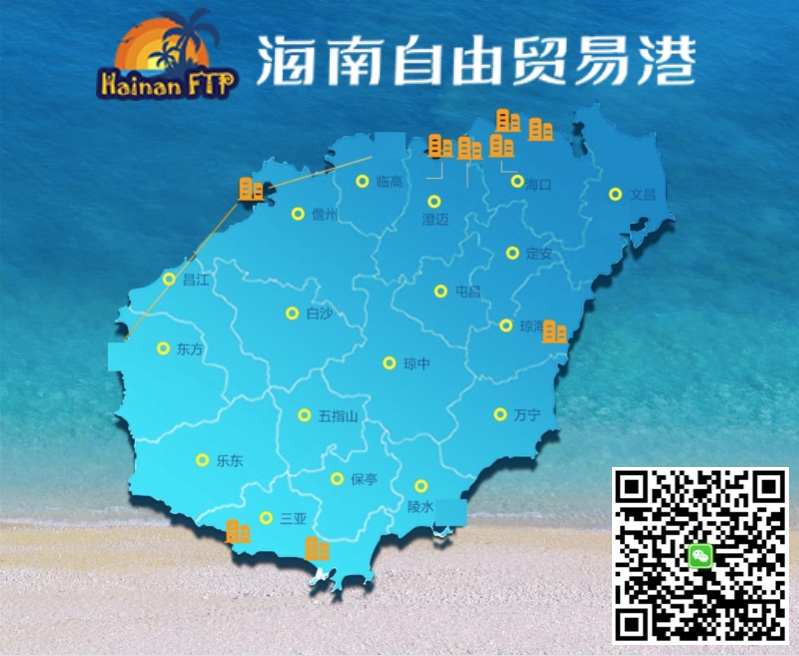

# 计算机技术分享：中国速度

apt、composer、nodejs 等常用工具在国外，内地开发者访问较慢，而[工信部特批的海南自贸港「国际互联网数据专用通道」](https://mp.weixin.qq.com/s/8L4XWiJs-5fKdLjmxfn7fA)可高速访问，本站分享内地镜像加速信息，让开发者感受「中国速度」。

[](https://coding.net/products/ci?cps_source=PIevZ6Jr)
[](https://github.com/china-speed/china-speed.github.io/actions)



## apt ubuntu

```shell
find /etc/apt/ -name "*.list" -print0 | xargs -0 sed -i 's/[a-z]\+.ubuntu.com/mirrors.aliyun.com/g'

find /etc/apt/ -name "*.list" -print0 | xargs -0 sed -i 's/[a-z]\+..ubuntu.com/mirrors.cloud.tencent.com/g'
```

## apt debian

注意：apt 使用 HTTP，阿里云、腾讯云的源都支持；如果用了 HTTPS 源，则 debian docker 需要额外安装 ca-certificates，导致体积变大。

```shell
find /etc/apt/ -name "*.list" -print0 | xargs -0 sed -i 's/[a-z]\+.debian.org/mirrors.aliyun.com/g'

find /etc/apt/ -name "*.list" -print0 | xargs -0 sed -i 's/[a-z]\+.debian.org/mirrors.cloud.tencent.com/g'
```

## get docker

```shell
# https://docs.docker.com/install/linux/docker-ce/ubuntu/#install-using-the-convenience-script

curl -fsSL https://get.docker.com | sh -s -- --mirror Aliyun

sudo usermod -aG docker $USER
```

## docker hub

```shell
sudo mkdir -p /etc/docker
sudo tee /etc/docker/daemon.json <<-'EOF'
{
  "registry-mirrors": [
    "https://hub-mirror.c.163.com"
  ]
}
EOF
sudo service docker restart
docker info
```

## docker Azure

> *.azk8s.cn 不再对外提供服务，仅限于 Azure China IP 使用。参考：[Azure/container-service-for-azure-china#60](https://github.com/Azure/container-service-for-azure-china/issues/60)

```shell
# docker pull mcr.microsoft.com/dotnet/core/runtime:3.1
# docker pull mcr.azk8s.cn/dotnet/core/runtime:3.1

# docker pull gcr.io/google_containers/hyperkube-amd64:v1.9.2
# docker pull gcr.azk8s.cn/google_containers/hyperkube-amd64:v1.9.2
```

## get kubectl

```shell
# https://kubernetes.io/docs/tasks/tools/install-kubectl/#install-kubectl-on-linux

wget -nc "https://coding-public-generic.pkg.coding.net/public/downloads/kubectl-linux-amd64?version=v1.22.4" -O kubectl-linux-amd64-v1.22.4 | true
chmod +x ./kubectl-linux-amd64-v1.22.4
sudo mv ./kubectl-linux-amd64-v1.22.4 /usr/local/bin/kubectl
kubectl version
```

## get helm

```shell
# https://github.com/helm/helm/releases

wget -nc "https://coding-public-generic.pkg.coding.net/public/downloads/helm-linux-amd64.tar.gz?version=v3.7.1" -O helm-linux-amd64-v3.7.1.tar.gz | true
tar -zxvf helm-v3.4.2-linux-amd64.tar.gz
sudo mv linux-amd64/helm /usr/local/bin/
helm version
```

## get composer

```shell
curl https://mirrors.cloud.tencent.com/composer/composer.phar -o /usr/local/bin/composer
curl https://mirrors.aliyun.com/composer/composer.phar -o /usr/local/bin/composer
chmod +x /usr/local/bin/composer
```

## composer

```shell
composer config -g repo.packagist composer https://mirrors.aliyun.com/composer/

composer config -g --unset repos.packagist
```

## composer lock

```shell
url_suffix='.dist.mirrors[0].url="https://mirrors.aliyun.com/composer/dists/%package%/%reference%.%type%"'
jq '."packages"[]'"$url_suffix" composer.lock \
    | jq '."packages"[].dist.mirrors[0].preferred=true' \
    | jq '."packages-dev"[]'"$url_suffix" \
    | jq --indent 4 '."packages-dev"[].dist.mirrors[0].preferred=true' > composer.lock.tmp
mv composer.lock.tmp composer.lock
```

## get nodejs npm

```shell
wget -nc "https://coding-public-generic.pkg.coding.net/public/downloads/node-linux-x64.tar.xz?version=v16.13.0" -O node-v16.13.0-linux-x64.tar.xz | true
tar -xf node-v16.13.0-linux-x64.tar.xz -C /usr --strip-components 1
node -v
```

## npm

注意：`npm install` 不使用 `package-lock.json` 中的完整下载链接（resolved 字段），而是使用 config registry。

```shell
# 淘宝
npm config set registry https://registry.npmmirror.com
npm config set disturl https://npmmirror.com/dist
npm config set electron_mirror https://npmmirror.com/mirrors/electron/
npm config set sass_binary_site https://npmmirror.com/mirrors/node-sass/
npm config set phantomjs_cdnurl https://npmmirror.com/mirrors/phantomjs/
npm config set puppeteer_download_host https://npmmirror.com/mirrors
npm config set chromedriver_cdnurl http://npmmirror.com/mirrors/chromedriver

# 腾讯云
npm config set registry https://mirrors.cloud.tencent.com/npm/
npm config set sass_binary_site https://mirrors.cloud.tencent.com/npm/node-sass
npm config set chromedriver_cdnurl https://mirrors.cloud.tencent.com/npm/chromedriver

# 恢复默认
npm config delete registry
```

## pip

```shell
mkdir ~/.pip
cat > ~/.pip/pip.conf << \EOF
[global]
index-url=https://pypi.doubanio.com/simple/
#index-url=https://mirrors.aliyun.com/pypi/simple/
#index-url=https://mirrors.cloud.tencent.com/pypi/simple/
EOF
```

## go

```shell
# goproxy.io 采用 腾讯云香港
# go env -w GOPROXY=https://goproxy.io,direct
# goproxy.cn 采用 七牛大陆 CDN
go env -w GOPROXY=https://goproxy.cn,direct
```

## gradle bin

官方 CDN 域名：downloads.gradle-dn.com 曾在中国落地，现已取消，无法继续使用。

```shell
sed -i 's/services.gradle.org\/distributions\//mirrors.cloud.tencent.com\/gradle\//g' ./gradle/wrapper/gradle-wrapper.properties

# 腾讯云
distributionUrl=https\://mirrors.cloud.tencent.com/gradle/gradle-6.6.1-bin.zip

# 默认国外
distributionUrl=https\://services.gradle.org/distributions/gradle-6.6.1-bin.zip
```

## gradle maven

Google maven 曾在中国落地，现已取消，需要内地加速。

```shell
mkdir ~/.gradle
cat > ~/.gradle/init.gradle << \EOF
def repoConfig = {
    all { ArtifactRepository repo ->
        if (repo instanceof MavenArtifactRepository) {
            def url = repo.url.toString()
            if (url.contains('repo1.maven.org/maven2')
                || url.contains('repo.maven.apache.org/maven2')
                || url.contains('jcenter.bintray.com')
                || url.contains('maven.google.com')
                || url.contains('plugins.gradle.org/m2')
                || url.contains('repo.spring.io/libs-milestone')
                || url.contains('repo.spring.io/plugins-release')
                || url.contains('repo.grails.org/grails/core')
                || url.contains('repository.apache.org/snapshots')
            ) {
                println "gradle init: [buildscript.repositories] (${repo.name}: ${repo.url}) removed"
                remove repo
            }
        }
    }

    // 腾讯云 maven 镜像聚合了：central、jcenter、google、gradle-plugin
    maven { url 'https://mirrors.cloud.tencent.com/nexus/repository/maven-public/' }
    // 阿里云 https://developer.aliyun.com/mvn/guide
    maven { url 'https://maven.aliyun.com/repository/central' }
    maven { url 'https://maven.aliyun.com/repository/jcenter' }
    maven { url 'https://maven.aliyun.com/repository/google' }
    maven { url 'https://maven.aliyun.com/repository/gradle-plugin' }
    maven { url 'https://maven.aliyun.com/repository/spring' }
    maven { url 'https://maven.aliyun.com/repository/spring-plugin' }
    maven { url 'https://maven.aliyun.com/repository/grails-core' }
    maven { url 'https://maven.aliyun.com/repository/apache-snapshots' }
}

allprojects {
    buildscript {
        repositories repoConfig
    }

    repositories repoConfig
}
EOF
```

## maven

```shell
sudo vi /etc/maven/settings.xml
```

```shell
vi ./settings.xml
mvn package -s settings.xml
```

https://docs.gitlab.cn/jh/user/packages/maven_repository/#%E8%AF%B7%E6%B1%82%E8%BD%AC%E5%8F%91%E5%88%B0-maven-central

```xml
<settings>
  <servers>
    <server>
      <id>central-proxy</id>
      <configuration>
        <httpHeaders>
          <property>
            <name>Job-Token</name>
            <value>${CI_JOB_TOKEN}</value>
          </property>
        </httpHeaders>
      </configuration>
    </server>
  </servers>
  <mirrors>
    <mirror>
      <id>central-proxy</id>
      <name>GitLab proxy of central repo</name>
      <url>https://jihulab.com/api/v4/groups/14276/-/packages/maven</url>
      <mirrorOf>central</mirrorOf>
    </mirror>
  </mirrors>
</settings>
```

```
<settings>
    <mirrors>
        <mirror>
            <id>aliyunmaven</id>
            <mirrorOf>*</mirrorOf>
            <name>阿里云公共仓库</name>
            <url>https://maven.aliyun.com/repository/public</url>
        </mirror>
</mirrors>
</settings>
```

```xml
<settings>
    <mirrors>
        <mirror>
            <id>tencent-maven</id>
            <mirrorOf>*</mirrorOf>
            <name>腾讯云公共仓库</name>
            <url>http://mirrors.cloud.tencent.com/nexus/repository/maven-public/</url>
        </mirror>
    </mirrors>
</settings>
```

## maven wrapper

```shell
sed -i 's/repo.maven.apache.org\/maven2/mirrors.cloud.tencent.com\/nexus\/repository\/maven-public/g' ./.mvn/wrapper/maven-wrapper.properties
```

## gem

```shell
gem sources --add https://gems.ruby-china.com/ --remove https://rubygems.org/
gem sources -l
# 确保输出只有 gems.ruby-china.com 一个
```

## bundle

```shell
bundle config mirror.https://rubygems.org https://gems.ruby-china.com
```

## acknowledgements

感谢 [腾讯云](https://cloud.tencent.com/act/cps/redirect?redirect=10042&cps_key=16b83d1aa2e322d67b11fa1daaa4ab6b)、[七牛云](https://marketing.qiniu.com/cps/redirect?redirect_id=4&cps_key=1h6w1ounb13yp) 提供云存储和国内 CDN。

感谢 [CODING 持续集成](https://coding.net/products/ci?cps_source=PIevZ6Jr) 提供免费的 Jenkins 云服务。

通过上述邀请链接注册，本站将获得流量奖励，供大家下载使用。
